# Air Quality Analysis

The U.S. Embassy has air quality monitors to measure PM 2.5 particulates as an indication of the air quality on the Embassy compound in China. 

The original data source is released by [U.S. Department of State Air Quality Monitoring Program](http://www.stateair.net/web/post/1/1.html). 

The data is collected from 2008 in Beijing, 2011 in Shanghai, 2011 in Guangzhou, 2012 in Chengdu, 2013 in Shenyang.

PM 2.5 is measure Partical Matter in size of 2.5 μm to indicate how good air quality is.

Based on the data, here is analytics on the air quality to understand trend and patterns. Great thanks US Embassy for collecting and publish the data.

Wish we have better and better air quality.

## The five cities

The five cities are marked with red text on the map. 

#### Beijing

* 21 million population in urban area
* Located in north of China
* Only a thin isolate band towards the sand area in Mongolia and Inner Mogolia. 

#### Shanghai

* 24 million population in urban area
* Located in east of China
* Near the east China sea.

#### Shenyang 

* 8 million population in urban area
* Located in north east of China. 
* Not close to the sea

#### Chengdu 

* 17 million population in urban area
* Located in inner China
* In a basin. 

#### Guangzhou 

* 20 million population in urban area
* Located in south of China
* Near the south China sea.

## Overall Air Quality by hour

The overall air quality aggregated by hours for all 5 cities. 

* 48.9% of hours in total has health air quality
* 29.8% of hours in total has moderate air quality
* 21.3% of hours in tatal has other air quality

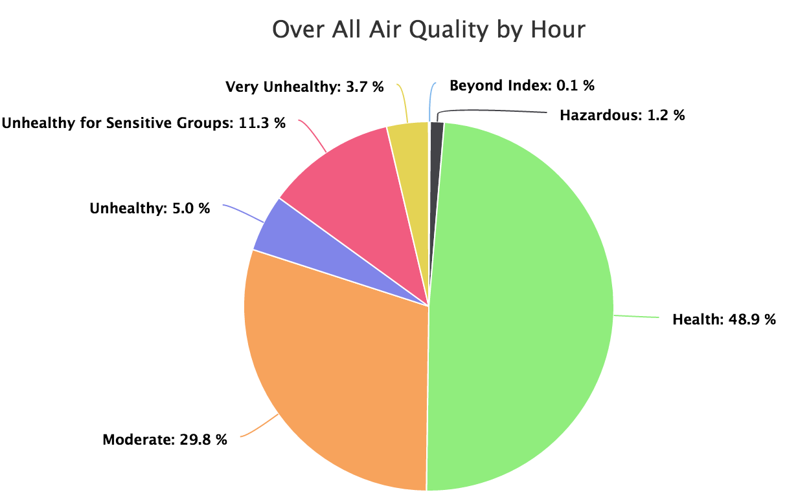

#### Overall Air Quality by City

<table>
<tr>
    <td width="400px">
    <h2>Guangzhou</h2> 
    <ul>
        <li>south of China</li>
        <li>close to sea</li>
        <li>frequent rain</li>
    </td>
    <td>
        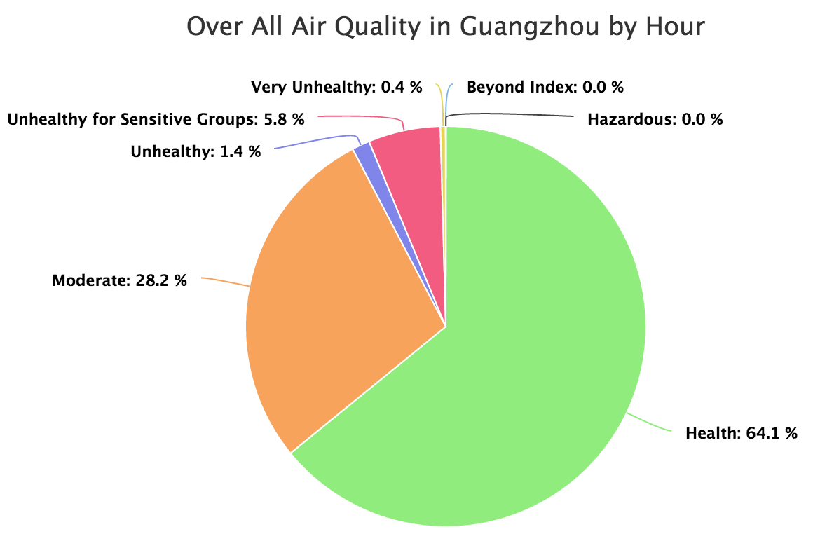
    </td>
</tr>
<tr>
    <td width="400px">
        <h2>Shanghai</h2>
        <ul>
            <li>East of China</li>
            <li>Close to the sea</li>
            <li>frequent rain in some month</li>
        </ul>
    </td><td>
    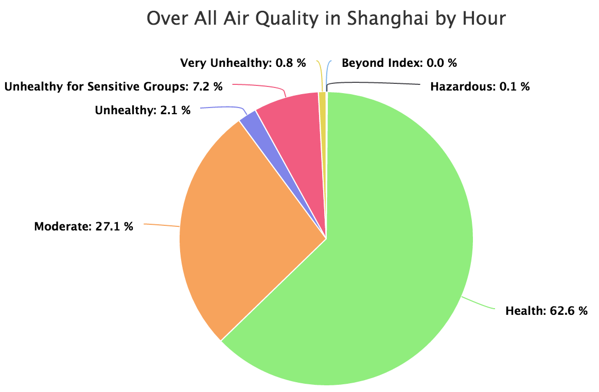</td>
</tr>
<tr>
    <td width="400px">
        <h2>Shengyang</h2>
        <ul>
            <li>Northeast of China</li>
        </ul>
    </td>
    <td>
    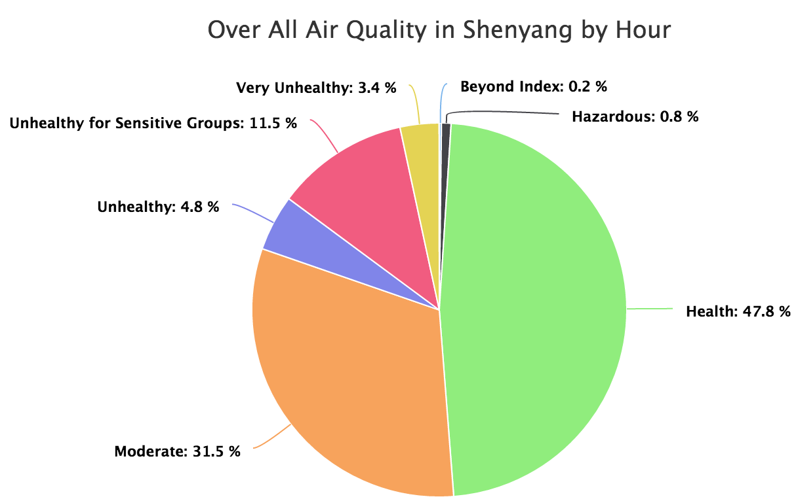
    </td>
</tr>
<tr>
    <td width="400px">
        <h2>Chengdu</h2>
        <ul>
            <li>Inner China</li>
        </ul>
    </td>
    <td>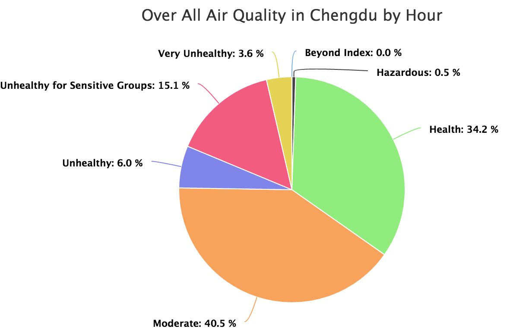</td>
</tr>
<tr>
    <td width="400px">
        <h2>Beijing</h2>
        <ul>
            <li>Captical City</li>
            <li>North of China</li>
        </ul>
    </td>
    <td>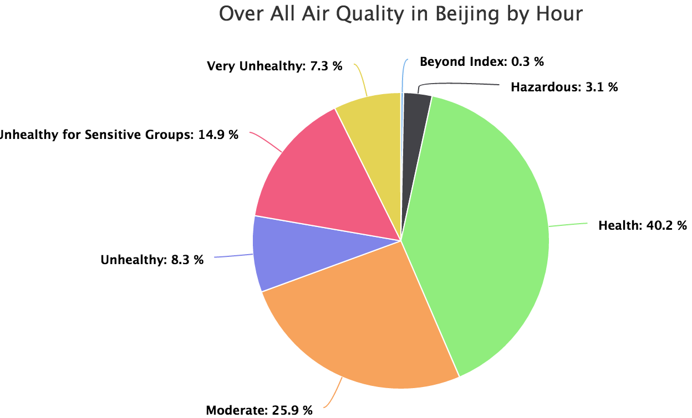</td>
</tr>
</table>

## Air Quality Changes Over Years

One year has 365 days * 24 hour/day= 8760 hour in total. 
Data collecting are started from 2008 in Beijing, and later in some cities.

From the stacked area chart, data is completed if it has 8760 data points collected in a year.
Otherwise some data are missing.

#### Air Quality China over Year combined all 5 cities

From the data, the air quality is gragually getting better since 2014. Seems the goverment is working on to have better balance between development speed and environment. Hope this trend will continue and getting better and better environment.

Data from 2013 has more completeness.

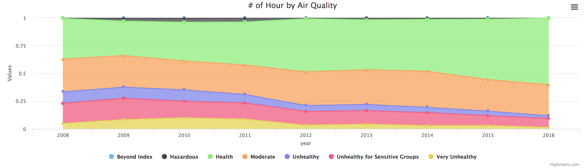

#### Air Quality Guangzhou over Years

* Data from 2013 has more completeness.
* Air quality improved a from 2013 to 2016.

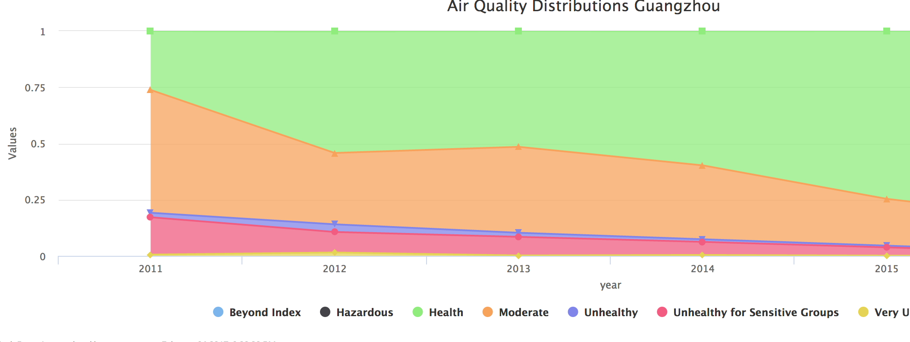

#### Air Quality Shanghai over Years

* Data from 2012 has more completeness.
* Air quality has minor improvement from 2012 to 2016.

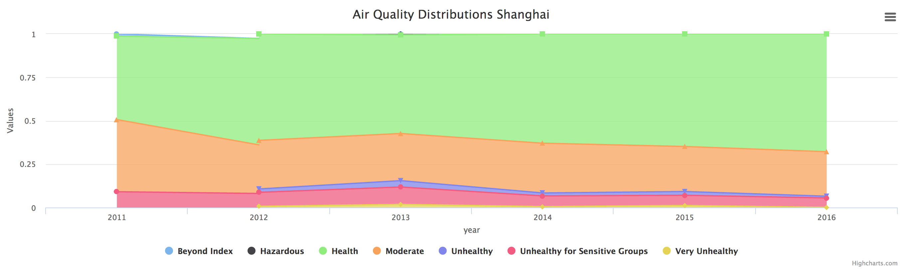

#### Air Quality Shenyang over Years
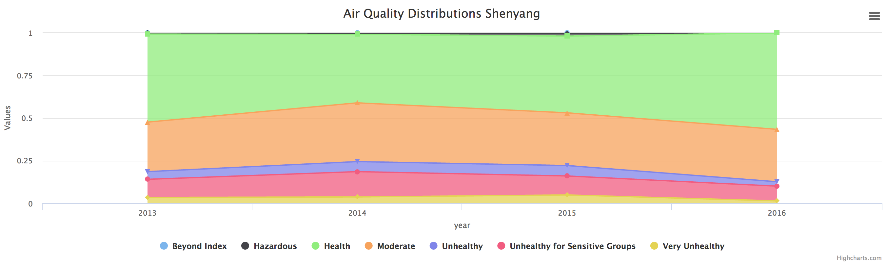

* Data from 2012 has more completeness while quite some data are still mining.
* Air quality has minor improvement from 2012 to 2016.

#### Air Quality Chengdu over Years

* Data from 2013 has more completeness.
* Air quality has minor improvement from 2013 to 2016.
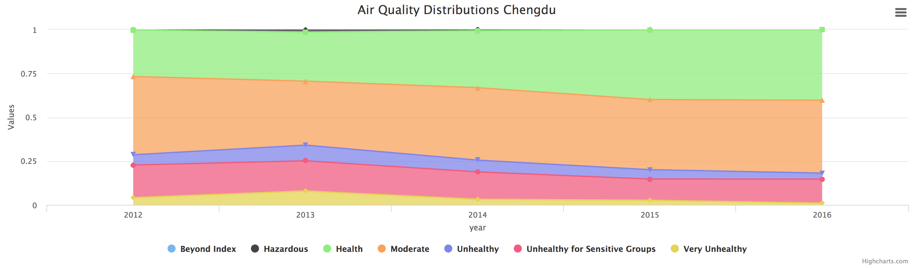

#### Air Quality Beijing over Years

* Data from 2010 has more completeness.
* Air quality has minor improvement from 2010 to 2016.

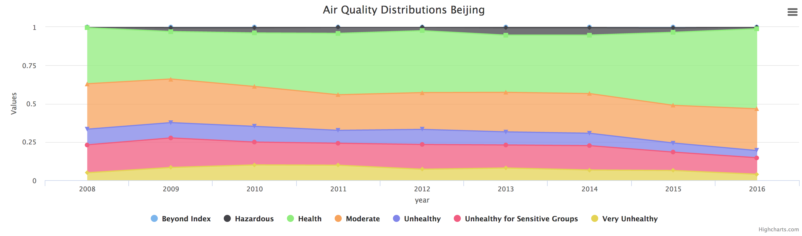

## Air Quality in a Year

Air Quality in a year also varies. In general the air quality is better in summer time and worse in winter time. The reason are mainly related to 

* More frequent rain in summer compare to winter.
* More heater used in winter.

## Air Quality During a Week

Air quality in a week usually reveal clear pattern.

#### Air Quality During a Week Beijing

Air quality in beijing reveals that better quality in day compare to night

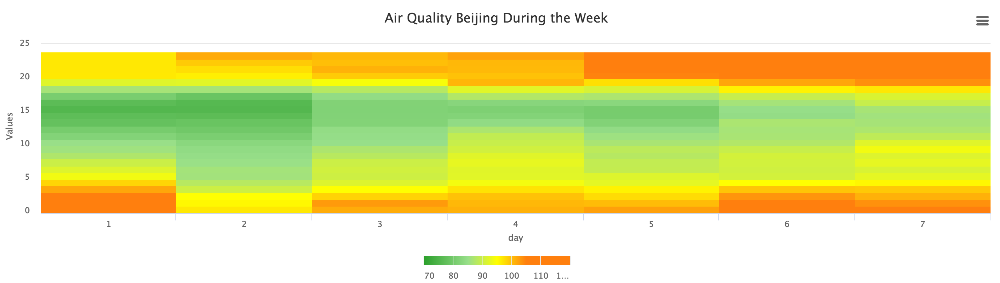

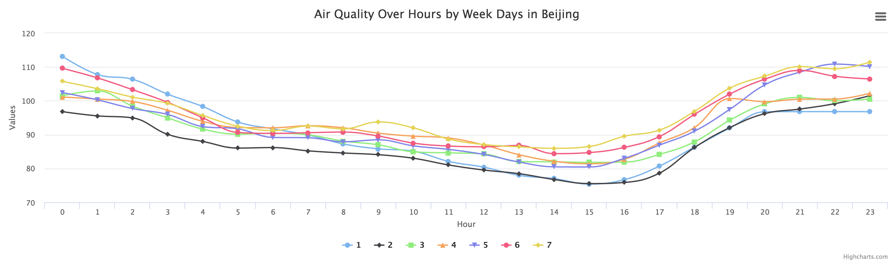

#### AirQualityOverHoursByWeek Guangzhou

Data reveals that the worst air quality if between 19:00 to 22:00

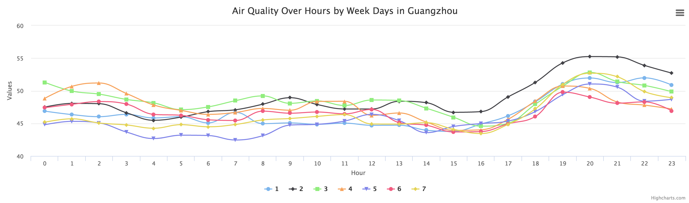

#### AirQualityOverHoursByWeek Shanghai

Data reveals that the worst air quality if between 19:00 to 21:00

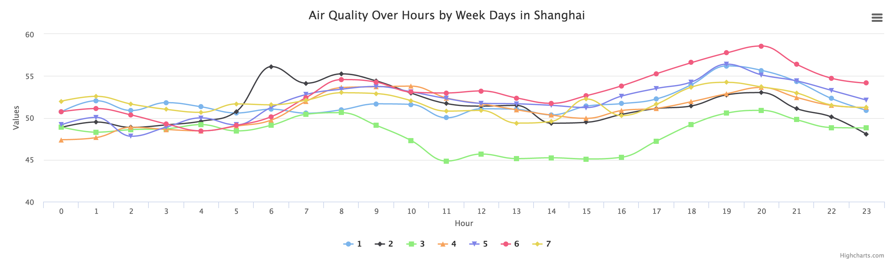

#### AirQualityOverHoursByWeek Shenyang

Data reveals that the worst air quality if between 6:00 to 9:00. So outdoor morning exercise seems not a good choice.

#### AirQualityOverHoursByWeek Chengdu

Data reveals that the worst air quality if between 8:00 to 10:00. And has the best quality in 15:00 18:00. 

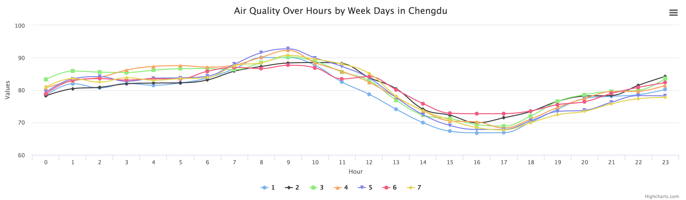

## Air Quality in 2016

To get a clear view without any data aggregration, here are the chart for air quality in 2016 for the 5 cities. Each point on the chart represent one hour.

#### Guangzhou

* Most of time air quality is in health level
* Fair amount of time air quality is in moderate level.
* Some sparks air quality execeed very unhealth level.

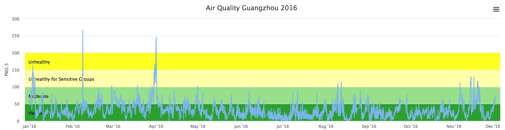

#### Shanghai

* Most of time air quality is in health an moderate level
* Some sparks air quality execeed goes to unhealth level.
* It has relative better air quality in Summer.

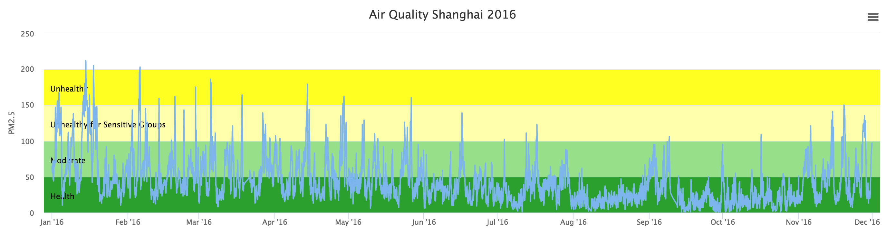

#### Shengyang

* Most of time air quality is in health an moderate level
* Fairly amount time air quality execeed goes to unhealth level.
* During November there are some time air quality goes very bad.
* It has relative good air quality in Summer.

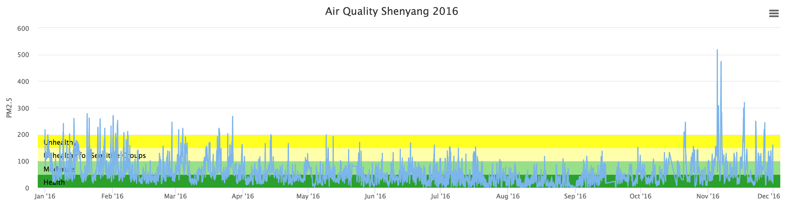

#### Chengdu

* Most of time air quality is in health an moderate level
* Fairly amount time air quality execeed goes to unhealth level.
* During November there are some time air quality goes very bad.
* It has relative good air quality in Summer.

#### Beijing

* Most of time air quality is in health an moderate level
* Fairly amount time air quality execeed goes to unhealth level.
* Air quality goes very bad in certain period.
* It has relative good air quality in Summer.

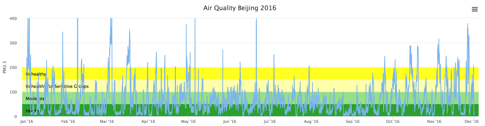

## Data Source

The original data source is from [U.S. Department of State Air Quality Monitoring Program](http://www.stateair.net/web/post/1/1.html)

#### Data completemess

|     city|having data |missing data|missing rate|
|---------|--------|-----------|-----------|
|Guangzhou|   39901|      11963|        23%|
|  Beijing|   70018|       4453|         6%|
|  Chengdu|   36786|       6318|        15%|
| Shenyang|   29185|       5135|        15%|
| Shanghai|   41925|       9939|        19%|

#### Air Quality Guide for PM2.5

| Air Quality Index (AQI)	| PM2.5 Health Effects Statement |	PM2.5 Cautionary Statement |
|:--------|-----|-----|
|Good (0-50)	|PM2.5 air pollution poses little or no risk. |	None
|Moderate (51-100)|	Unusually sensitive individuals may experience respiratory symptoms.	| Unusually sensitive people should consider limiting prolonged outdoor exertion. 
| Unhealthy for Sensitive Groups  (101-150)| 	Increasing likelihood of respiratory symptoms in sensitive individuals, aggravation of heart or lung disease and premature mortality in persons with cardiopulmonary disease and the elderly.|	Active children and adults, and people with respiratory disease, such as asthma, should limit prolonged outdoor exertion. |
| Unhealthy (151-200) | Increased aggravation of heart or lung disease and premature mortality in persons with cardiopulmonary disease and the elderly; increased respiratory effects in general population.| Active children and adults, and people with respiratory disease, such as asthma, should avoid prolonged outdoor exertion; everyone else, especially children, should limit prolonged outdoor exertion.|
| Very Unhealthy (201-300)	| Significant aggravation of heart or lung disease and premature mortality in persons with cardiopulmonary disease and the elderly; significant increase in respiratory effects in general population.|Active children and adults, and people with respiratory disease, such as asthma, should avoid all outdoor exertion; everyone else, especially children, should limit outdoor exertion.
| Hazardous (301-500) | Serious aggravation of heart or lung disease and premature mortality in persons with cardiopulmonary disease and the elderly; serious risk of respiratory effects in general population.| Everyone should avoid all outdoor exertion.|
| Beyond Index (>500)	| Extremely High Levels of PM2.5: Steps to Reduce Your Exposure

